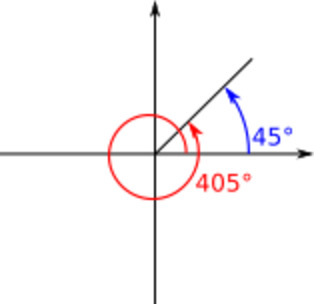
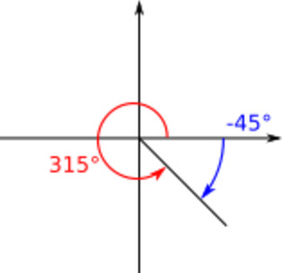

# 問題00-10 \sqrt{-1}2^3\Sigma\pi

角度の”変換”に関する問題

(1) 下図のように角θ(正の整数)を 0° <= θ < 360°の範囲に変換せよ

(2) 例のように角θ(実数)を -180°<= θ < 180°の範囲に変換せよ

(3) 前問と同じ要領で角 θ = a / b * π (ラジアン，aとbは整数)を - π <= θ < π の範囲に変換せよ

